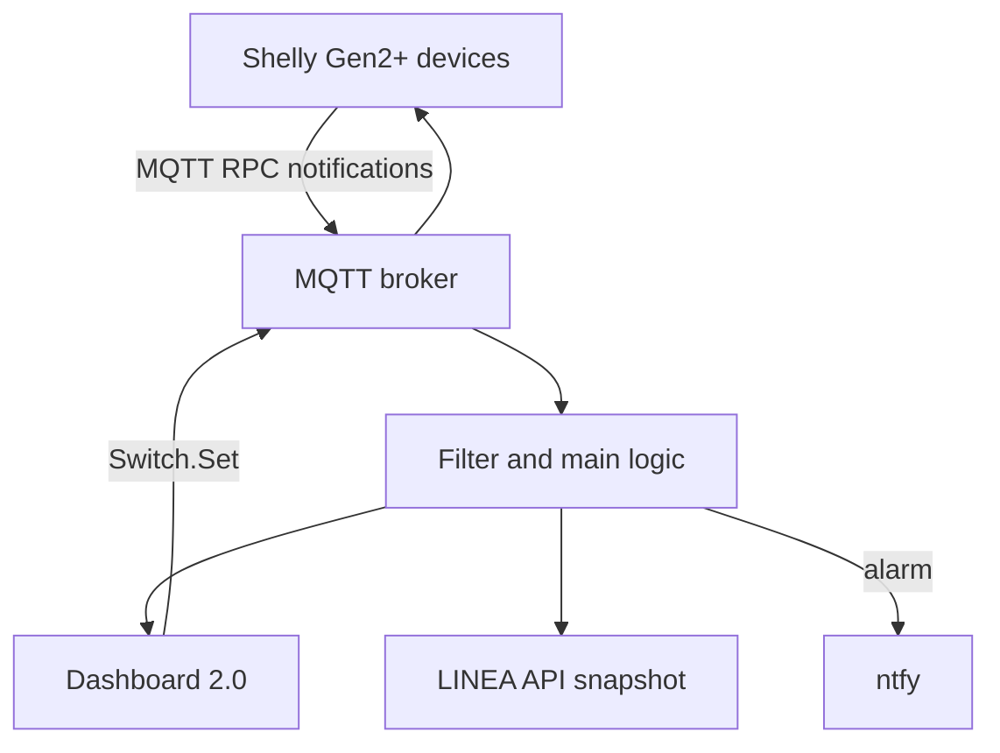

[🇨🇿 **Česky**](README_CZ.md) | [🇬🇧 English](README.md) | [Linea project](https://github.com/hacesoft/Linea)

# Shelly Module for LINEA

**Local monitoring and control of Shelly devices over MQTT in Node-RED Dashboard 2.0.**


## Overview

The module integrates Shelly devices into LINEA and its Node-RED Dashboard. Communication is local through MQTT, so Shelly Cloud and a Shelly account are not required for basic operation.

Features:

- Shelly Plus Smoke monitoring;
- battery percentage, voltage, Wi-Fi RSSI and last-report display;
- ntfy alerts for alarm start/end, detector tests and low battery;
- monitoring and control of Shelly Plug, Plus/Pro and Pro 4PM outputs;
- power, voltage, current and accumulated-energy display when supplied by the device;
- read-only monitoring of digital inputs;
- status polling every 60 seconds;
- immediate updates from MQTT notifications;
- drag-and-drop card ordering;
- a Dashboard configuration page;
- read-only state snapshots for the LINEA API.

> [!IMPORTANT]
> **The MQTT broker IP address is not configured on `/dashboard/config`. It must be edited manually in the MQTT configuration node inside the flow.** Unlike the Modbus connection, this module deliberately does not make the MQTT broker fully configurable from the Dashboard. Attempts to change a live MQTT connection dynamically from the UI resulted in unstable behavior, so direct flow configuration is intentional.

## Supported devices and data model

The flow expects the MQTT RPC format used by **Shelly Gen2+** devices. Typical compatible devices expose components such as `switch:N`, `input:N`, `smoke:0`, and `devicepower:0`.

| Type | Module functionality | Notes |
|---|---|---|
| Shelly Plus Smoke | alarm, battery, voltage, RSSI, wake-up cause, ntfy | The detector normally sleeps to preserve its battery |
| Shelly Plug / Plus Plug | relay state, control, power and energy | MQTT RPC support is required |
| Shelly Plus/Pro relays | outputs `switch:0` through `switch:3` | Configure every channel separately |
| Shelly Pro 4PM | four outputs and measurements | Channels 0–3 |
| Digital inputs | `input:0` through `input:3` | Read-only cards without a control switch |

Shelly Gen1 uses different MQTT topics and payload formats and is not directly compatible without an adapter or code changes. The module does not directly process `cover`, `light`, `em`, `temperature`, or Bluetooth components.

## Architecture



The MQTT input subscribes to `#`. Its switch node passes:

- Node-RED response topics beginning with `nr_`;
- notifications ending in `/events/rpc`;
- smoke-detector messages through the same `/events/rpc` branch.

## MQTT topics and RPC

For a device topic prefix `<prefix>`, the module uses:

| Direction | Topic | Purpose |
|---|---|---|
| Shelly → Node-RED | `<prefix>/events/rpc` | `NotifyStatus`, `NotifyFullStatus`, `NotifyEvent` |
| Node-RED → Shelly | `<prefix>/rpc` | `Switch.Set`, `Switch.GetStatus`, `Input.GetStatus` |
| Shelly → Node-RED | `nr_<key>/rpc` | response to a status request |

The default topic prefix is usually the device ID. If you configure a custom prefix, it must exactly match the module's **MQTT prefix** field. The module property `mqtt_id` therefore means topic prefix; it is not necessarily the optional MQTT `client_id`.

## Requirements

- Node-RED;
- [FlowFuse Dashboard / Node-RED Dashboard 2.0](https://dashboard.flowfuse.com/getting-started.html), declared as `@flowfuse/node-red-dashboard` 1.30.2 in the supplied flow;
- an MQTT broker reachable by Node-RED and every Shelly device;
- Shelly Gen2+ devices with MQTT and RPC enabled;
- optionally [ntfy](https://docs.ntfy.sh/) for notifications;
- the [LINEA](https://github.com/hacesoft/Linea) project for complete integration.

The flow includes a Dashboard base at `/dashboard`, the `/FVE` and `/config` pages, groups and a theme. When importing it into an existing Dashboard, check for duplicate configuration nodes.

## Critical configuration: MQTT broker address

The supplied flow contains this default broker configuration:

```text
Configuration node name: NAS_docker_mqtt
Broker: 192.168.20.100
Port: 1883
TLS: disabled
```

This address belongs to the original installation and must be changed on most other networks. **Do not look for it on the Shelly configuration page at `/dashboard/config`**. That page configures individual devices, their IP addresses, MQTT prefixes and channels; it does not configure Node-RED's broker connection.

### Where to change the address

1. Open the Node-RED editor.
2. Locate the **`SHELLY::MQTT`** group.
3. Double-click **`MQTT Switch events`**. You can also open **`MQTT Switch RPC`**; both nodes share the same broker configuration.
4. In the **Server** field, select **`NAS_docker_mqtt`** and click the pencil icon to edit it.
5. Change:

   - **Server/Broker** — the IP address or hostname of your Mosquitto/MQTT server;
   - **Port** — normally `1883`, or a TLS port such as `8883`;
   - **Username and Password** — when authentication is enabled on the broker;
   - **TLS** — when the connection is encrypted.

6. Confirm the configuration node with **Update/Add**, then close the MQTT node with **Done**.
7. Click **Deploy**. The new broker address takes effect only after the flow is deployed.
8. Configure the same broker address, port and credentials on every Shelly device.
9. Confirm that the MQTT input node shows **connected**. Then trigger `Vyzadej stav (start + 60s)` manually and verify that responses arrive.

The address only needs to be changed once in `NAS_docker_mqtt`, because the MQTT input and output nodes share it. No Function-node JavaScript needs to be edited.

### Why the broker is not configurable from the Dashboard

The LINEA Modbus integration can use its own stable UI-managed configuration. An MQTT node, however, owns a persistent runtime connection, subscriptions, authentication, TLS and reconnect behavior. Dynamically rewriting these properties from the Dashboard without a standard deployment produced instability during testing. The module therefore intentionally separates:

- **MQTT broker** — configured manually in the flow;
- **Shelly devices** — configured on `/dashboard/config`.

## Installation with LINEA

1. Back up the current Node-RED flow and configuration files.
2. Confirm that `@flowfuse/node-red-dashboard` is installed through Palette Manager.
3. In Node-RED, choose **Menu → Import → Clipboard** and paste `shelly_flows_19092026_1851.json`.
4. If an older Shelly module already exists, do not keep two active MQTT branches subscribed to `#`. Disable or replace the old version first.
5. Following the previous section, manually open `NAS_docker_mqtt` in the flow and replace the default `192.168.20.100` address, port, credentials and TLS settings. This cannot be changed from the Dashboard.
6. Verify the `SAVE_NEW_CONFIG`, `RESET`, and `RESET_GUI` links to the main LINEA flow.
7. Click **Deploy**.
8. Open `/dashboard/config`, add the devices and save the configuration.
9. Complete the First-start checklist below.

In the full LINEA project, the Shelly configuration is stored in `ShellyDevices_hacesoft.json`. The standalone export includes the `SAVE_NEW_CONFIG` link-out node but not its destination file-writing branch.

## Connecting a Shelly device to the network

Repeat these steps for every device:

1. Power the Shelly and connect a phone or computer to its temporary Wi-Fi access point.
2. Open `http://192.168.33.1` in a browser.
3. Under **Settings → Wi-Fi**, connect the device to a network that can reach the MQTT broker.
4. Configure a static IP or DHCP reservation. A stable address is needed for the Admin button and device maintenance.
5. Open the new Shelly IP address in a browser.
6. Update the firmware and enable local administration authentication where supported.

Shelly Cloud may remain disabled. Local web administration and MQTT do not require a cloud account.

## Shelly MQTT configuration

In the device's local web UI, open **Settings → MQTT** or **Settings → Connectivity → MQTT** and configure:

| Setting | Value |
|---|---|
| Enable MQTT | enabled |
| Server | broker host and port, for example `192.168.20.100:1883` |
| Username / password | according to the broker configuration |
| Topic prefix | a unique device prefix, or retain the default device ID |
| Enable RPC | enabled |
| RPC status notifications / `rpc_ntf` | enabled |
| Generic status notifications / `status_ntf` | not required by this flow |

Changing MQTT configuration requires or triggers a device reboot. After startup, MQTT status must show connected. Shelly publishes RPC notifications on `<prefix>/events/rpc` and receives requests on `<prefix>/rpc`.

### MQTT broker recommendations

- do not allow anonymous access outside an isolated trusted network;
- create a dedicated user and topic-scoped ACLs;
- port 1883 is unencrypted; use TLS across an untrusted network;
- never use a public broker for relay control or fire-related notifications;
- the supplied flow uses MQTT 3.1.1, a 60-second keepalive, and subscribes to `#`.

## Adding a smoke detector

1. Open `http://<node-red>/dashboard/config`.
2. In the smoke-detector section, enter:

   - **Name** — a descriptive name such as `Boiler room`;
   - **IP address** — the Shelly's fixed address;
   - **MQTT prefix** — the exact topic prefix configured on the device.

3. Click **Add**, then use the main **Save** button.
4. Wake or test the detector so it publishes its first MQTT data.

The card displays:

- alarm or OK status;
- battery percentage and voltage;
- Wi-Fi RSSI in dBm;
- time of the latest data;
- wake-up reason;
- availability of the Admin button.

A detector is shown as awake for only 120 seconds after its latest message. It then appears as **sleeping**. For a battery-powered Shelly Plus Smoke this is expected power-saving behavior, not automatically a fault or loss of protection.

## Adding an output, Plug, or Pro 4PM

On `/dashboard/config`, create one entry for every displayed channel:

| Field | Meaning |
|---|---|
| Type | `Output` for a controlled relay, `Input` for a read-only digital input |
| Name | Text shown on the Dashboard card |
| IP address | Address of the physical Shelly |
| MQTT prefix | Device topic prefix |
| Channel | 0, 1, 2, or 3 |

Example four-channel configuration:

```json
{
  "switches": [
    { "name": "Rack fan 1",    "ip": "192.168.20.31", "mqtt_id": "shellypro4pm-aabbcc", "channel": 0, "kind": "output", "order": 0 },
    { "name": "Rack fan 2",    "ip": "192.168.20.31", "mqtt_id": "shellypro4pm-aabbcc", "channel": 1, "kind": "output", "order": 1 },
    { "name": "Service socket", "ip": "192.168.20.31", "mqtt_id": "shellypro4pm-aabbcc", "channel": 2, "kind": "output", "order": 2 },
    { "name": "Door contact",  "ip": "192.168.20.31", "mqtt_id": "shellypro4pm-aabbcc", "channel": 0, "kind": "input",  "order": 3 }
  ],
  "smoke": []
}
```

When entries share the same IP address, the configuration UI automatically reuses and synchronizes their MQTT prefix.

## Control and state refresh

Using a Dashboard switch publishes this RPC request:

```json
{
  "id": 1,
  "src": "nodered",
  "method": "Switch.Set",
  "params": { "id": 0, "on": true }
}
```

Five seconds after Node-RED starts, and then every 60 seconds, the module publishes:

- `Switch.GetStatus` for outputs;
- `Input.GetStatus` for inputs.

Between polls, cards are updated from `NotifyStatus` and `NotifyFullStatus`. Output cards may display:

- ON/OFF state;
- active power (`apower`);
- voltage;
- current;
- total energy (`aenergy.total`), divided by 1000 for the kWh display.

If a device does not provide a measurement, the UI displays `--`.

## Card ordering

Cards can be reordered using the `⋮⋮` handle. The new order is written to `global.shellyDevices.switches[].order`.

> In the current flow, the `saveOrder` branch does not invoke `SAVE_NEW_CONFIG`. The order may therefore not be written to LINEA's `ShellyDevices_hacesoft.json` and can revert after a restart. After reordering, open the configuration page and use its main Save button, or extend `saveOrder` to invoke persistent storage.

## Timers

The configuration page exposes a **Timer** option and ON/OFF times. The current flow only stores these values:

```json
"timer": { "enabled": true, "on": "08:00", "off": "20:00" }
```

**No node in the supplied flow executes these timers. The timer is currently a prepared configuration field, not working automation.** Use Shelly's built-in Schedule feature or add Node-RED scheduling logic.

## ntfy notifications

The destination is read from:

```javascript
global.get('config').ntfyConfig.url
```

### Creating the first ntfy topic

Basic use of the public ntfy.sh service does not require registration. A topic is created when it is first subscribed to or published to. Its name effectively acts as a password, so use a long random value.

1. Install the ntfy app or open `https://ntfy.sh`.
2. Subscribe to a topic such as `linea-fire-<long-random-string>`.
3. Store the full URL in LINEA configuration:

   ```text
   https://ntfy.sh/linea-fire-<long-random-string>
   ```

4. Test it directly and then run the detector's test.

For sensitive deployments, use authenticated access or a self-hosted ntfy server. A difficult-to-guess public topic is not a substitute for authentication.

### Events and priorities

| Event | Message | Priority |
|---|---|---|
| Detector test | `Test cidla: <name>` | low |
| Alarm begins | `POZAR! <name>` | urgent |
| Alarm ends | `Poplach ukoncen. <name>` | default |
| Battery below 20% | `Baterie <name>: <level>%` | high |

ntfy is a supplementary information channel only. Delivery depends on the detector, Wi-Fi, broker, Node-RED, Internet/self-hosted server, and phone. It must not replace the detector's certified local audible alarm or other fire-safety measures.

## LINEA API export

The module creates two read-only global snapshots.

### `global.lineaApiShellySmokeState`

It contains:

- detector name;
- alarm and OK state;
- battery percentage and voltage;
- RSSI;
- wake-up reason;
- latest report and its age.

### `global.lineaApiShellyState`

For every named input and output it contains:

- name;
- `input`/`output` type;
- channel number;
- Boolean state;
- state availability.

IP addresses, MQTT identifiers and electrical measurements are deliberately excluded. A snapshot is created or refreshed only after actual MQTT data is processed.

## Standalone use without LINEA

The UI, MQTT monitoring and control can operate independently, but the integration services normally supplied by LINEA must be added.

### 1. Default global configuration

In the **On Start** tab of a separate Function node, initialize:

```javascript
if (!global.get('defaultShellyDevices')) {
    global.set('defaultShellyDevices', { switches: [], smoke: [] });
}

if (!global.get('config')) {
    global.set('config', {
        ntfyConfig: { url: 'https://ntfy.sh/YOUR_LONG_RANDOM_TOPIC' }
    });
}
```

### 2. Persistent storage

The standalone export does not include the destination of `SAVE_NEW_CONFIG`. Replace it with your own file-writing branch or configure Node-RED's default context store as `localfilesystem`:

```javascript
contextStorage: {
    default: {
        module: "localfilesystem"
    }
}
```

Node-RED stores context in memory by default, so it is cleared on restart. Restart Node-RED after changing `settings.js`.

### 3. External links

`RESET`, `RESET_GUI`, and `SAVE_NEW_CONFIG` are integration points for LINEA. In a standalone deployment, connect them to your own start/reset/persistence logic or remove them after providing equivalent behavior.

## First-start checklist

1. The MQTT broker is reachable from Node-RED and the Shelly network.
2. The broker node has the correct credentials and TLS settings.
3. Every Shelly has a static IP or DHCP reservation.
4. MQTT, RPC and RPC notifications are enabled on each device.
5. The Dashboard MQTT prefix exactly matches the Shelly topic prefix.
6. Shelly reports MQTT `connected: true` after reboot.
7. Messages appear on `<prefix>/events/rpc`.
8. Input/output state appears in the Dashboard within 60 seconds.
9. Toggling a test relay controls the correct physical channel.
10. A smoke-detector test appears in the Dashboard and reaches ntfy.
11. Configuration survives a Node-RED restart.
12. Test broker, Wi-Fi and Node-RED failures before connecting critical loads.

## Troubleshooting

### A device does not appear

- verify the broker and Shelly MQTT connection;
- compare the topic prefix and `mqtt_id` exactly;
- check that `/events/rpc` notifications are being published;
- wait for the one-minute poll or manually trigger `Vyzadej stav`;
- confirm that the MQTT input produces a parsed JSON object rather than plain text.

### A card is marked unknown

The flow has seen a switch channel from a prefix/channel pair absent from configuration. Add it on `/dashboard/config`, or correct the MQTT prefix and channel.

### The control switch is disabled

It remains disabled until the `output` state is known. Inspect the `Switch.GetStatus` response, RPC permissions and the `nr_<prefix>:<channel>/rpc` response topic.

### Power or energy remains `--`

The device does not provide the value or has not published it in the latest status. Not every Shelly relay includes power metering.

### A smoke detector always appears asleep

This is expected for a battery-powered detector after two minutes without a message. Wake it with its test function and confirm a new MQTT notification.

### ntfy does not send messages

- inspect `global.config.ntfyConfig.url`;
- verify the full topic URL;
- inspect `Debug_NTFY_Cidla` and HTTP errors;
- check DNS/Internet or self-hosted ntfy availability;
- an empty URL leaves the HTTP request without a valid destination.

### Configuration disappears after restart

The standalone module lacks LINEA's destination file branch, and default Node-RED context is memory-only. Add file persistence or a `localfilesystem` context store.

## Known limitations

- supports Shelly Gen2+ MQTT RPC, not Gen1 directly;
- the MQTT input subscribes to `#`, which may be unnecessarily expensive on a large broker;
- timer settings are stored but never executed;
- drag-and-drop ordering does not invoke file persistence;
- only `params.events[0]` is processed from each `NotifyEvent` message;
- every `NotifyFullStatus` below 20% battery may send another ntfy alert because there is no cooldown/deduplication;
- smoke-detector availability is inferred from message age, not MQTT online/LWT status;
- API snapshots are created only after real data arrives;
- the UI accepts IPv4 addresses only, not hostnames or IPv6;
- a manual toggle does not wait for an RPC acknowledgement; later MQTT status corrects the displayed state;
- ntfy has no flow-level retry, deduplication or phone-delivery acknowledgement.

## Recommended next improvements

1. Replace the `#` subscription with precise or dynamically generated topic subscriptions.
2. Implement timer execution or hide the timer UI until it works.
3. Invoke persistent storage from `saveOrder`.
4. Process every entry in `params.events`.
5. Add cooldown and deduplication for low-battery notifications.
6. Monitor `<prefix>/online` to distinguish a sleeping detector from an unavailable device.
7. Add RPC acknowledgement, timeout and visible control-error states.
8. Centralize broker, ntfy and security settings.

## Security

- This module is not a fire-alarm control panel or safety PLC.
- Power-output control must follow device ratings, electrical protection and manufacturer instructions.
- Protect the Node-RED Dashboard with authentication; otherwise anyone who can open it may control relays.
- Never expose the MQTT broker directly to the Internet.
- Do not commit private IPs, MQTT credentials or ntfy topics to a public repository.
- Physically test smoke detectors at the intervals required by the manufacturer.