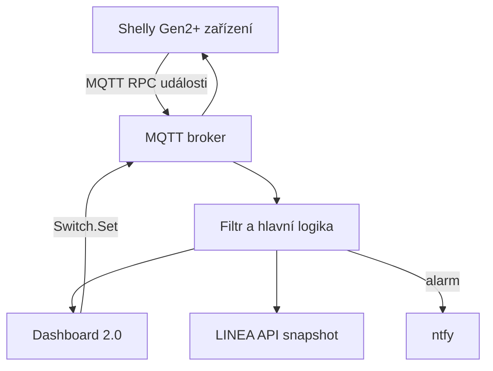

[🇨🇿 **Česky**](README_CZ.md) | [🇬🇧 English](README.md) | [Linea project](https://github.com/hacesoft/Linea)

# Shelly modul pro LINEA

**Lokální monitoring a ovládání zařízení Shelly přes MQTT v Node-RED Dashboard 2.0.**

## Přehled

Modul integruje zařízení Shelly do projektu LINEA a jeho Node-RED Dashboardu. Komunikace probíhá lokálně přes MQTT, takže pro základní provoz není nutný Shelly Cloud ani účet Shelly.

Modul zajišťuje:

- monitoring kouřových čidel Shelly Plus Smoke;
- zobrazení stavu baterie, napětí, Wi-Fi signálu a posledního hlášení čidla;
- upozornění přes ntfy při poplachu, ukončení poplachu, testu čidla a nízké baterii;
- monitoring a ovládání výstupů Shelly Plug, Plus/Pro a Pro 4PM;
- zobrazení výkonu, napětí, proudu a celkové energie, pokud je zařízení poskytuje;
- monitoring digitálních vstupů v režimu pouze pro čtení;
- pravidelné načítání stavů každých 60 sekund;
- automatické aktualizace při MQTT událostech;
- ruční změnu pořadí karet přetažením;
- konfigurační stránku v Dashboardu;
- read-only export základních stavů do globálních objektů LINEA API.

> [!IMPORTANT]
> **IP adresa MQTT brokeru se nenastavuje na stránce `/dashboard/config`. Musí se upravit ručně přímo v MQTT konfiguračním nodu ve flow.** Na rozdíl od Modbus připojení není MQTT broker v tomto modulu plně konfigurovatelný z uživatelského rozhraní. Pokusy o dynamickou změnu MQTT připojení z Dashboardu vedly k nestabilnímu chování, proto je ruční nastavení ve flow záměrné.

## Podporovaná zařízení a datový model

Flow očekává MQTT RPC formát zařízení **Shelly Gen2+**. Patří sem typicky řady Plus, Pro a novější zařízení používající komponenty `switch:N`, `input:N`, `smoke:0` a `devicepower:0`.

| Typ | Funkce v modulu | Poznámka |
|---|---|---|
| Shelly Plus Smoke | alarm, baterie, napětí, RSSI, probuzení, ntfy | Čidlo většinu času spí, což je normální |
| Shelly Plug / Plus Plug | stav relé, ovládání, výkon a energie | Zařízení musí podporovat MQTT RPC |
| Shelly Plus/Pro relé | výstupy `switch:0` až `switch:3` | Každý kanál se konfiguruje samostatně |
| Shelly Pro 4PM | čtyři výstupy a měření | Kanály 0–3 |
| Digitální vstupy | stav `input:0` až `input:3` | Pouze čtení, bez ovládacího přepínače |

Shelly Gen1 používá jiné MQTT topiky a datové formáty. Bez převodní vrstvy nebo úpravy flow není s tímto modulem přímo kompatibilní. Modul také přímo nezpracovává komponenty typu `cover`, `light`, `em`, `temperature` nebo Bluetooth zařízení.

## Architektura



Vstupní MQTT node odebírá topik `#` a následný switch propouští:

- odpovědi Node-RED začínající `nr_`;
- události končící `/events/rpc`;
- kouřová čidla jsou zpracována přes stejnou větev `/events/rpc`.

## MQTT topiky a RPC

Pro prefix zařízení `<prefix>` používá modul tyto topiky:

| Směr | Topik | Použití |
|---|---|---|
| Shelly → Node-RED | `<prefix>/events/rpc` | `NotifyStatus`, `NotifyFullStatus`, `NotifyEvent` |
| Node-RED → Shelly | `<prefix>/rpc` | `Switch.Set`, `Switch.GetStatus`, `Input.GetStatus` |
| Shelly → Node-RED | `nr_<klíč>/rpc` | odpověď na požadavek stavu |

Výchozí topic prefix bývá ID zařízení. Pokud na Shelly nastavíte vlastní prefix, musí přesně odpovídat poli **MQTT prefix** v konfiguraci modulu. Pole `mqtt_id` v modulu tedy znamená topic prefix; nemusí být totožné s volitelným MQTT `client_id`.

## Požadavky

- Node-RED;
- [FlowFuse Dashboard / Node-RED Dashboard 2.0](https://dashboard.flowfuse.com/getting-started.html), v dodaném flow deklarovaný jako `@flowfuse/node-red-dashboard` 1.30.2;
- MQTT broker dostupný z Node-RED i ze všech Shelly zařízení;
- zařízení Shelly Gen2+ se zapnutým MQTT a RPC;
- pro notifikace volitelně služba [ntfy](https://docs.ntfy.sh/);
- pro úplnou integraci projekt [LINEA](https://github.com/hacesoft/Linea).

Flow obsahuje vlastní Dashboard base `/dashboard`, stránky `/FVE` a `/config`, skupiny a téma. Při importu do existujícího Dashboardu zkontrolujte, zda nevznikly duplicitní konfigurační nody.

## Zásadní nastavení: adresa MQTT brokeru

V dodaném flow je MQTT broker přednastavený takto:

```text
Název konfiguračního nodu: NAS_docker_mqtt
Broker: 192.168.20.100
Port: 1883
TLS: vypnuto
```

Tato adresa je specifická pro původní instalaci a ve většině jiných sítí se musí změnit. **Nehledejte ji v konfigurační stránce Shelly na `/dashboard/config`** — tato stránka nastavuje jednotlivá zařízení, jejich IP adresy, MQTT prefixy a kanály, nikoliv připojení Node-RED k brokeru.

### Kde adresu změnit

1. Otevřete editor Node-RED.
2. Najděte skupinu **`SHELLY::MQTT`**.
3. Dvakrát klikněte na node **`MQTT Switch events`**. Stejně lze otevřít i výstupní node **`MQTT Switch RPC`**; oba používají stejný broker.
4. U položky **Server** vyberte konfigurační node **`NAS_docker_mqtt`** a klikněte na ikonu tužky pro jeho úpravu.
5. Změňte:

   - **Server/Broker** – IP adresu nebo hostname vašeho Mosquitto/MQTT serveru;
   - **Port** – obvykle `1883`, případně port TLS, například `8883`;
   - **Username a Password** – pokud broker vyžaduje přihlášení;
   - **TLS** – pokud používáte šifrované spojení.

6. Potvrďte úpravu konfiguračního nodu tlačítkem **Update/Add** a zavřete MQTT node tlačítkem **Done**.
7. Klikněte na **Deploy**. Změna MQTT brokeru se projeví až po nasazení flow.
8. Stejnou adresu brokeru, port a přihlašovací údaje nastavte také ve všech Shelly zařízeních.
9. Pod vstupním MQTT nodem ověřte stav **connected**. Potom ručně spusťte inject `Vyzadej stav (start + 60s)` a zkontrolujte, že dorazí odpovědi.

Adresu stačí změnit jednou v konfiguračním nodu `NAS_docker_mqtt`, protože jej sdílí MQTT vstup i výstup. Není potřeba upravovat JavaScript ve Function nodech.

### Proč není broker nastavitelný z Dashboardu

Modbus část LINEA může používat vlastní stabilně řízenou konfiguraci z UI. MQTT node však spravuje trvalé spojení, subscriptions, autentizaci, TLS a opětovné připojování na úrovni Node-RED runtime. Dynamické přepisování těchto parametrů z Dashboardu bez standardního deploye vedlo při testech k nestabilitě. Z tohoto důvodu modul úmyslně odděluje:

- **MQTT broker** – ruční nastavení přímo ve flow;
- **Shelly zařízení** – konfigurace z Dashboardu `/dashboard/config`.

## Instalace v projektu LINEA

1. Zazálohujte aktuální Node-RED flow a konfigurační soubory.
2. Ověřte, že v Palette Manageru máte `@flowfuse/node-red-dashboard`.
3. V Node-RED vyberte **Menu → Import → Clipboard** a vložte obsah `shelly_flows_19092026_1851.json`.
4. Pokud už starší Shelly modul existuje, neponechávejte současně dvě aktivní MQTT větve odebírající `#`. Starou verzi nejprve deaktivujte nebo nahraďte.
5. Podle předchozí kapitoly ručně otevřete konfigurační node `NAS_docker_mqtt` přímo ve flow a změňte výchozí adresu `192.168.20.100`, port, uživatele, heslo a případně TLS. Z Dashboardu tuto změnu provést nelze.
6. Zkontrolujte propojení link nodů `SAVE_NEW_CONFIG`, `RESET` a `RESET_GUI` s hlavním projektem LINEA.
7. Klikněte na **Deploy**.
8. Otevřete `/dashboard/config`, přidejte zařízení a konfiguraci uložte.
9. Proveďte kontrolní testy uvedené v části První spuštění.

V plném projektu LINEA se konfigurace Shelly ukládá do souboru `ShellyDevices_hacesoft.json`. Samotný přiložený modul obsahuje odesílací link `SAVE_NEW_CONFIG`, ale neobsahuje jeho cílovou souborovou větev.

## První připojení Shelly do sítě

Následující postup proveďte pro každé zařízení:

1. Zapněte Shelly a připojte se z telefonu nebo počítače k jeho dočasné Wi-Fi síti.
2. V prohlížeči otevřete `http://192.168.33.1`.
3. V **Settings → Wi-Fi** připojte zařízení k síti, ze které dosáhne na MQTT broker.
4. Nastavte pevnou IP adresu nebo vytvořte DHCP rezervaci. Stálá adresa je důležitá pro tlačítko Admin a správu zařízení.
5. Po připojení otevřete novou IP adresu Shelly v prohlížeči.
6. Aktualizujte firmware a nastavte autentizaci lokální administrace, pokud ji zařízení podporuje.

Shelly Cloud může zůstat vypnutý. Lokální webové rozhraní a MQTT cloudový účet nepotřebují.

## Nastavení MQTT na Shelly

V lokálním webovém rozhraní zařízení otevřete **Settings → MQTT** nebo **Settings → Connectivity → MQTT** a nastavte:

| Položka | Hodnota |
|---|---|
| Enable MQTT | zapnuto |
| Server | IP/hostname brokeru a port, např. `192.168.20.100:1883` |
| Username / password | podle konfigurace brokeru |
| Topic prefix | jedinečný prefix zařízení, nebo ponechte výchozí ID |
| Enable RPC | zapnuto |
| RPC status notifications / `rpc_ntf` | zapnuto |
| Generic status notifications / `status_ntf` | pro tento flow nejsou nutné |

Po změně MQTT nastavení se Shelly restartuje nebo je potřeba restart provést ručně. Po startu musí stav MQTT ukazovat připojeno. Shelly oficiálně publikuje RPC notifikace na `<prefix>/events/rpc` a požadavky přijímá na `<prefix>/rpc`.

### Doporučení pro MQTT broker

- nepoužívejte anonymní přístup mimo izolovanou důvěryhodnou síť;
- vytvořte samostatného uživatele a ACL pouze pro potřebné topiky;
- port 1883 je nešifrovaný; přes nedůvěryhodnou síť použijte TLS;
- veřejný broker není vhodný pro ovládání relé ani požární signalizaci;
- výchozí flow používá MQTT 3.1.1, keepalive 60 s a na vstupu odebírá `#`.

## Přidání kouřového čidla

1. Otevřete `http://<node-red>/dashboard/config`.
2. V sekci kouřových čidel zadejte:

   - **Název** – čitelný název, například `Kotelna`;
   - **IP adresa** – pevná IP Shelly;
   - **MQTT prefix** – přesná hodnota topic prefixu z nastavení Shelly.

3. Klikněte na **Přidat** a poté na hlavní **Uložit**.
4. Probuďte čidlo nebo spusťte jeho test, aby odeslalo první MQTT data.

Karta zobrazuje:

- alarm nebo stav OK;
- procento a napětí baterie;
- RSSI Wi-Fi v dBm;
- čas posledních dat;
- důvod probuzení;
- dostupnost tlačítka Admin.

Za aktivní je čidlo považováno pouze 120 sekund od poslední zprávy. Potom se zobrazí jako **spí**. U bateriového Shelly Plus Smoke je spánek běžný úsporný režim, nikoliv automaticky chyba nebo ztráta ochrany.

## Přidání výstupu, Plug nebo Pro 4PM

Na stránce `/dashboard/config` přidejte jeden záznam pro každý zobrazovaný kanál:

| Pole | Význam |
|---|---|
| Typ | `Výstup` pro ovládané relé, `Vstup` pro read-only digitální vstup |
| Název | Text zobrazený na kartě |
| IP adresa | Adresa fyzického Shelly |
| MQTT prefix | Topic prefix zařízení |
| Kanál | 0, 1, 2 nebo 3 |

Příklad čtyřkanálového Pro 4PM:

```json
{
  "switches": [
    { "name": "Rack ventilátor 1", "ip": "192.168.20.31", "mqtt_id": "shellypro4pm-aabbcc", "channel": 0, "kind": "output", "order": 0 },
    { "name": "Rack ventilátor 2", "ip": "192.168.20.31", "mqtt_id": "shellypro4pm-aabbcc", "channel": 1, "kind": "output", "order": 1 },
    { "name": "Zásuvka servis",    "ip": "192.168.20.31", "mqtt_id": "shellypro4pm-aabbcc", "channel": 2, "kind": "output", "order": 2 },
    { "name": "Kontakt dveří",     "ip": "192.168.20.31", "mqtt_id": "shellypro4pm-aabbcc", "channel": 0, "kind": "input",  "order": 3 }
  ],
  "smoke": []
}
```

Při zadání stejné IP adresy konfigurační stránka automaticky přebírá a synchronizuje MQTT prefix mezi kanály stejného zařízení.

## Ovládání a aktualizace stavu

Kliknutí na přepínač v Dashboardu odešle RPC požadavek:

```json
{
  "id": 1,
  "src": "nodered",
  "method": "Switch.Set",
  "params": { "id": 0, "on": true }
}
```

Každých 60 sekund a také 5 sekund po startu Node-RED modul odešle pro všechny pojmenované kanály:

- `Switch.GetStatus` pro výstupy;
- `Input.GetStatus` pro vstupy.

Mezi dotazy se karty aktualizují také z `NotifyStatus` a `NotifyFullStatus`. Výstupní karta může zobrazovat:

- stav ZAPNUTO/VYPNUTO;
- činný výkon `apower`;
- napětí;
- proud;
- celkovou energii `aenergy.total`, kterou flow převádí dělením 1000 na kWh.

Pokud dané zařízení některou veličinu neposkytuje, zobrazí se `--`.

## Pořadí karet

Karty lze přesouvat za úchyt `⋮⋮`. Nové pořadí se uloží do `global.shellyDevices.switches[].order`.

> V aktuálním flow větev `saveOrder` nevolá `SAVE_NEW_CONFIG`. V plné instalaci proto pořadí nemusí být zapsáno do `ShellyDevices_hacesoft.json` a po restartu se může vrátit. Po přetažení otevřete konfiguraci a použijte hlavní Uložit, případně doplňte do větve `saveOrder` souborové uložení.

## Časovače

Konfigurační stránka obsahuje volbu **Časovač** a časy zapnutí/vypnutí. Aktuální flow tyto hodnoty pouze ukládá do konfigurace:

```json
"timer": { "enabled": true, "on": "08:00", "off": "20:00" }
```

**Žádný node v dodaném flow podle těchto hodnot relé nezapíná ani nevypíná. Časovač je zatím pouze připravené konfigurační pole, nikoliv funkční automatizace.** Pro časové řízení použijte přímo Shelly Schedule nebo doplňte plánovací logiku v Node-RED.

## Notifikace ntfy

Flow čte cílovou URL z:

```javascript
global.get('config').ntfyConfig.url
```

### Vytvoření prvního ntfy tématu

Pro veřejnou službu ntfy.sh není k základnímu použití nutná registrace. Téma vznikne při prvním odběru nebo publikování; jeho název funguje podobně jako heslo, proto použijte dlouhý náhodný název.

1. Nainstalujte aplikaci ntfy nebo otevřete web `https://ntfy.sh`.
2. Přihlaste odběr například tématu `linea-fire-<dlouhý-náhodný-řetězec>`.
3. Do konfigurace LINEA vložte celou URL:

   ```text
   https://ntfy.sh/linea-fire-<dlouhý-náhodný-řetězec>
   ```

4. Otestujte ji z prohlížeče/terminálu nebo testem kouřového čidla.

Pro citlivý provoz použijte účet s řízením přístupu nebo vlastní ntfy server. Pouhé těžko uhodnutelné veřejné téma není náhradou autentizace.

### Události a priority

| Událost | Text | Priorita |
|---|---|---|
| Test čidla | `Test cidla: <název>` | low |
| Začátek alarmu | `POZAR! <název>` | urgent |
| Konec alarmu | `Poplach ukoncen. <název>` | default |
| Baterie pod 20 % | `Baterie <název>: <stav>%` | high |

ntfy je pouze doplňkový informační kanál. Doručení závisí na čidle, Wi-Fi, MQTT brokeru, Node-RED, internetu/self-hosted serveru a telefonu. Nesmí nahrazovat akustickou signalizaci certifikovaného kouřového čidla ani další požární opatření.

## Export do LINEA API

Modul vytváří dva globální read-only snapshoty.

### `global.lineaApiShellySmokeState`

Obsahuje:

- název čidla;
- alarm a OK stav;
- baterii v procentech a voltech;
- RSSI;
- důvod probuzení;
- poslední hlášení a jeho stáří.

### `global.lineaApiShellyState`

Obsahuje pro pojmenované vstupy a výstupy:

- název;
- typ `input`/`output`;
- číslo kanálu;
- logický stav;
- dostupnost stavu.

Do API se záměrně neexportují IP adresy, MQTT identifikátory ani elektrické veličiny. Snapshot se vytvoří nebo obnoví až při zpracování skutečných MQTT dat.

## Samostatné použití bez LINEA

Uživatelské rozhraní, MQTT komunikace a ovládání mohou fungovat i samostatně. Je však nutné doplnit části, které v plném systému zajišťuje LINEA.

### 1. Výchozí globální konfigurace

V samostatném Function nodu v záložce **On Start** nastavte například:

```javascript
if (!global.get('defaultShellyDevices')) {
    global.set('defaultShellyDevices', { switches: [], smoke: [] });
}

if (!global.get('config')) {
    global.set('config', {
        ntfyConfig: { url: 'https://ntfy.sh/VASE_DLOUHE_NAHODNE_TEMA' }
    });
}
```

### 2. Trvalé uložení

Samostatný export neobsahuje cílovou větev `SAVE_NEW_CONFIG`. Buď ji nahraďte vlastním file nodem, nebo nastavte výchozí Node-RED context store na `localfilesystem`:

```javascript
contextStorage: {
    default: {
        module: "localfilesystem"
    }
}
```

Výchozí Node-RED context je pouze v paměti a po restartu se smaže. Po změně `settings.js` restartujte Node-RED.

### 3. Externí linky

Linky `RESET`, `RESET_GUI` a `SAVE_NEW_CONFIG` jsou v modulu připravené pro LINEA. V samostatném nasazení je můžete napojit na vlastní start/reset flow nebo odstranit, pokud jejich funkci nahradíte jinak.

## První spuštění – kontrolní seznam

1. MQTT broker je dostupný z Node-RED i ze sítě Shelly.
2. V broker nodu jsou správné přihlašovací údaje a TLS.
3. Každé Shelly má pevnou IP nebo DHCP rezervaci.
4. MQTT, RPC a RPC notifications jsou na zařízení zapnuté.
5. MQTT prefix v Dashboardu přesně odpovídá topic prefixu Shelly.
6. Po rebootu Shelly hlásí MQTT `connected: true`.
7. Na brokeru se objevují zprávy `<prefix>/events/rpc`.
8. Po nejvýše 60 sekundách se v Dashboardu načte stav výstupů a vstupů.
9. Přepnutí testovacího relé v Dashboardu fyzicky změní správný kanál.
10. Test kouřového čidla se zobrazí v Dashboardu a dorazí do ntfy.
11. Po restartu Node-RED zůstane konfigurace zachovaná.
12. Než připojíte důležitou zátěž, otestujte výpadek brokeru, Wi-Fi a Node-RED.

## Řešení problémů

### Zařízení se v Dashboardu nezobrazuje

- ověřte broker a stav MQTT na Shelly;
- porovnejte přesně topic prefix a `mqtt_id`;
- zkontrolujte, že zařízení publikuje `/events/rpc`;
- počkejte na minutový dotaz stavu nebo ručně spusťte inject `Vyzadej stav`;
- ověřte, že MQTT vstup dostává JSON objekt, ne neparsovaný text.

### Karta ukazuje „neznáme“

Flow zachytilo výstup z MQTT prefixu/kanálu, který není v konfiguraci. Přidejte jej na `/dashboard/config` nebo opravte MQTT prefix a číslo kanálu.

### Přepínač je zakázaný

Dokud není znám `output` stav, přepínač je záměrně disabled. Ověřte odpověď na `Switch.GetStatus`, RPC oprávnění a topik `nr_<prefix>:<kanál>/rpc`.

### Výkon nebo energie zůstává `--`

Zařízení danou hodnotu neposkytuje nebo ji neposlalo v posledním statusu. Ne všechna Shelly relé měří výkon.

### Kouřové čidlo stále ukazuje „spí“

U bateriového čidla je to běžné. Stav znamená, že více než dvě minuty nepřišla zpráva. Probuďte čidlo testem a ověřte novou zprávu.

### ntfy neodesílá zprávy

- zkontrolujte `global.config.ntfyConfig.url`;
- ověřte plnou URL tématu;
- zkontrolujte výstup `Debug_NTFY_Cidla` a HTTP chyby;
- ověřte DNS/internet nebo dostupnost vlastního ntfy serveru;
- prázdná URL způsobí, že HTTP request nemá platný cíl.

### Konfigurace po restartu zmizí

V samostatném modulu chybí cílová souborová větev LINEA a výchozí Node-RED context je v paměti. Doplňte file storage nebo `localfilesystem` context.

## Známá omezení současného flow

- podporuje MQTT RPC strukturu Shelly Gen2+, nikoliv přímo Gen1;
- MQTT vstup odebírá `#`, což může být na velkém brokeru zbytečně náročné;
- časovače se pouze konfigurují, ale nevykonávají;
- drag-and-drop pořadí nevolá souborové uložení;
- zpracuje pouze první položku `params.events[0]` v jedné `NotifyEvent` zprávě;
- při baterii pod 20 % může každé další `NotifyFullStatus` vytvořit nové ntfy upozornění, protože chybí časový limit/deduplikace;
- dostupnost kouřového čidla je odvozena pouze od stáří poslední zprávy, ne od MQTT online/LWT;
- API snapshot vzniká až po skutečných datech;
- UI akceptuje jen IPv4 adresu, ne hostname nebo IPv6;
- ruční přepnutí nečeká na potvrzení před změnou ovládacího prvku; skutečný stav se následně opraví z MQTT statusu;
- ntfy větev nemá vlastní retry, deduplikaci ani potvrzení doručení do telefonu.

## Doporučené úpravy další verze

1. Nahradit MQTT odběr `#` přesnějšími topiky nebo dynamickými subscriptions.
2. Doplnit skutečné provádění časovačů, nebo jejich nefunkční UI zatím skrýt.
3. Po `saveOrder` spustit stejnou perzistenci jako tlačítko Uložit.
4. Zpracovat všechny položky v `params.events`, nikoliv pouze první.
5. Přidat deduplikaci a opakování upozornění na nízkou baterii.
6. Sledovat `<prefix>/online` a odlišit spící čidlo od skutečně nedostupného zařízení.
7. Přidat potvrzení RPC, timeout a viditelný stav chyby ovládání.
8. Přesunout broker, ntfy a bezpečnostní nastavení do jasně oddělené centrální konfigurace.

## Bezpečnost

- Modul není požární ústředna ani bezpečnostní PLC.
- Ovládání silových výstupů musí respektovat zatížení, jištění a dokumentaci výrobce.
- Node-RED Dashboard zabezpečte autentizací; jinak může relé ovládat každý, kdo stránku otevře.
- MQTT broker nevystavujte přímo do internetu.
- IP adresy, MQTT údaje a ntfy témata neukládejte do veřejného repozitáře.
- U kouřových čidel pravidelně provádějte fyzický test podle návodu výrobce.